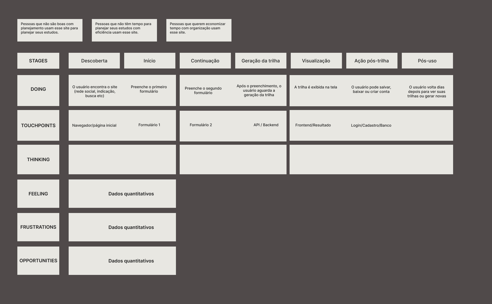
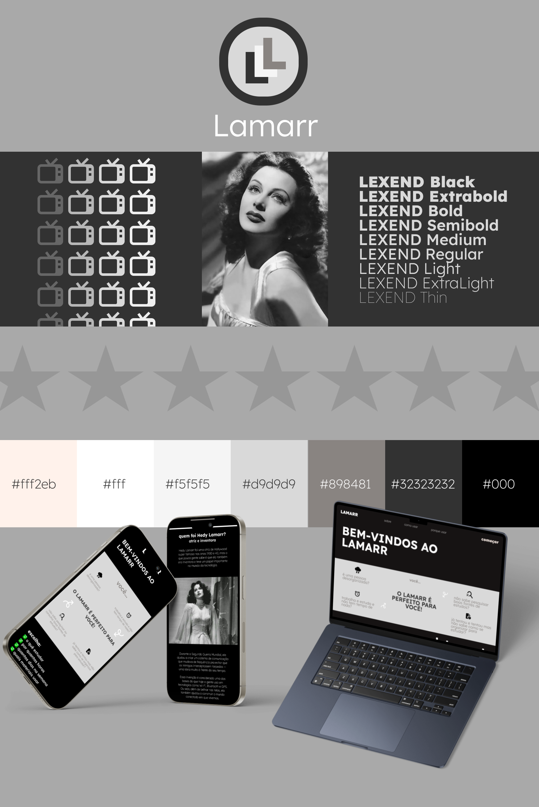

  

<h2 align="center">Lamarr - Trilha de aprendizado em menos de 5 minutos </h1>

🛠️ Readme em construção... 

<i>

 📚 O Lamarr foi idealizado principalmente para aqueles que têm vontade de aprender e pouco tempo para pensar em uma forma organizada de fazê-lo. Ao gerar uma trilha de conhecimento e uma rotina de estudos personalizados para você, respeitando seu tempo e melhores estilos de aprendizado, o Lamarr agiliza o processo de pesquisa por material e conteúdo para que você só se preocupe em estudar.

 📚 Antes de tudo, você deverá responder dois questionários. O primeiro para entendermos o que você pretende estudar, como, por quantas horas e etc. O segundo pretende analisar a forma de estudo que mais tem a ver com você pra te proporcionar a melhor experiência.

</i>

<h3>Apresentação breve</h2>

 Esse é o primeiro projeto que construo de forma bem eficientemente organizada do início ao fim, sempre que criar alguma coisa, estarei colocando aqui na documentação.

<h2>📄 Documentação </h2>

 Documentos como requisitos, modelagens de casos de uso, personas, JTBD, user stories e use cases podem ser encontrados na pasta docs, na raíz do projeto.

<h2> 🗺️ Journey Map </h2>

<h2>💻 Tecnologias</h2>

 Produzido com Vue.js, Vuetify e Typescript

 Ele também utilizará <a href="https://openai.com/api/"> a API do ChatGPT</a> para gerar os roadmaps.</a> 

  

.................

<h2> 🖼️ Design </h2>

 Feito no figma! Ainda em desenvolvimento... 

 Wireframes Desktop, Mobile, Paleta de cores e Tipografia podem ser consultados em public/imgs.

💡 <i>Esse projeto foi inicialmente feito para a Imersão Dev Alura + Google Gemini em 2024. Decidi criar esse projeto em Vue.js para melhora-lo e disponibilizá-lo para o mundo.</i>

 O Lamarr foi feito com muito sofrimento em um dia e meio de programação, por favor, respeitem os direitos autorais! ❤️

